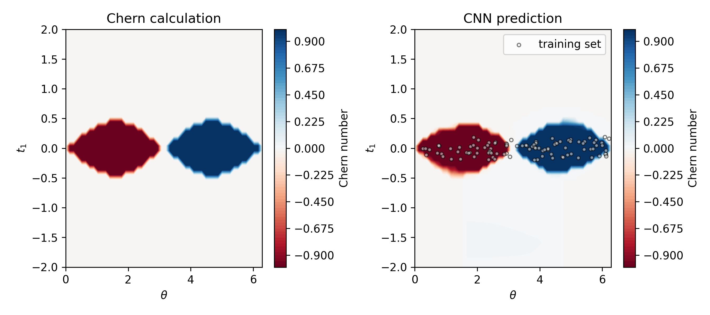

# Neural network models to learn calculation of topological invarients

Ongoing project on using Neural networks to calculate topological invarients

### Example

Chern Number calculation of Haldene model using CNN

  

